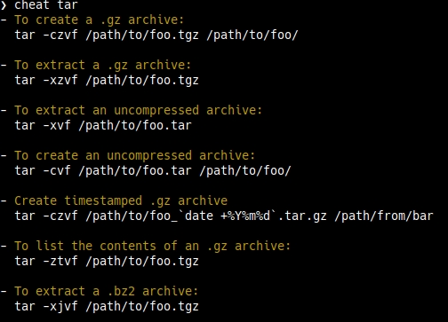
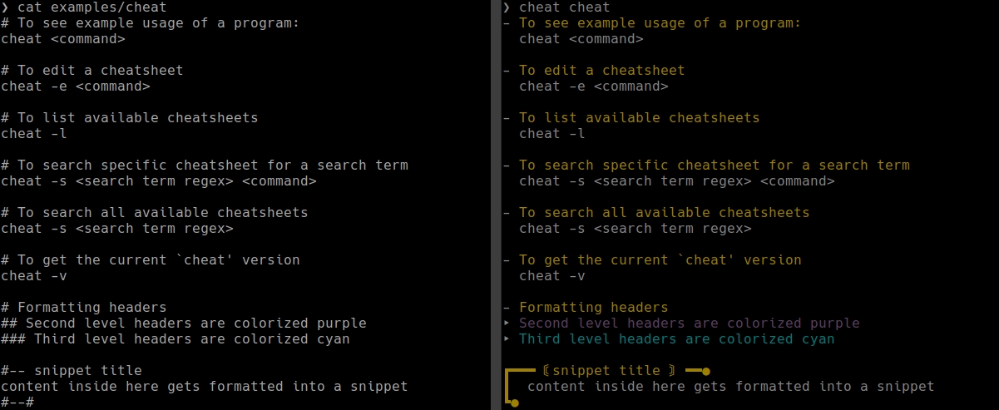

# cheat
[](https://circleci.com/gh/jakewarren/cheat)
[](https://github.com/jakewarren/cheat/releases])
[](https://github.com/jakewarren/cheat/blob/master/LICENSE)
[](https://goreportcard.com/report/github.com/jakewarren/cheat)
[](http://makeapullrequest.com)
> cheat allows you to create, view, and edit cheatsheets on the command-line.

This project is a re-implementation of [Chris Lane's cheatsheet](https://github.com/chrisallenlane/cheat) script in Go along with a few added features and some opinionated formatting & colorization. 



## Install
### Option 1: Binary

Download the latest release from [https://github.com/jakewarren/cheat/releases/latest](https://github.com/jakewarren/cheat/releases/latest)

### Option 2: From source

```
go get github.com/jakewarren/cheat
```

## Usage

### Configuring
`cheat` is configured by a JSON file located at `~/.cheatrc`. A default config will be generated for you:

```json
{
    "highlight": true,
    "cheatdirs": [
        "~/.cheat"
    ],
    "editor": "vim"
}
```

| Configuration Option | Description                                                                                                                                 |
|----------------------|---------------------------------------------------------------------------------------------------------------------------------------------|
| highlight            | controls the colorization of the output                                                                                                     |
| cheatdirs            | an array of directories to search for cheatsheets in. when a new cheatsheet is created, it will be placed in the first directory specified. |
| editor               | specifies the editor to be called when editing a cheat sheet                                                                                |

### Cheatsheets

Cheatsheets are plain-text files with no file extension, and are named according to the command used to view them:

```
cheat tar     # file is named "tar"
cheat git     # file is named "git"
```

Example cheatsheet syntax (left) and display (right):



## Acknowledgements
- [cheat/cheat](https://github.com/cheat/cheat)
- [dufferzafar/cheat](https://github.com/dufferzafar/cheat)

## Changes

All notable changes to this project will be documented in the [changelog].

The format is based on [Keep a Changelog](http://keepachangelog.com/) and this project adheres to [Semantic Versioning](http://semver.org/).

## License

MIT © 2019 Jake Warren

[changelog]: https://github.com/jakewarren/cheat/blob/master/CHANGELOG.md
